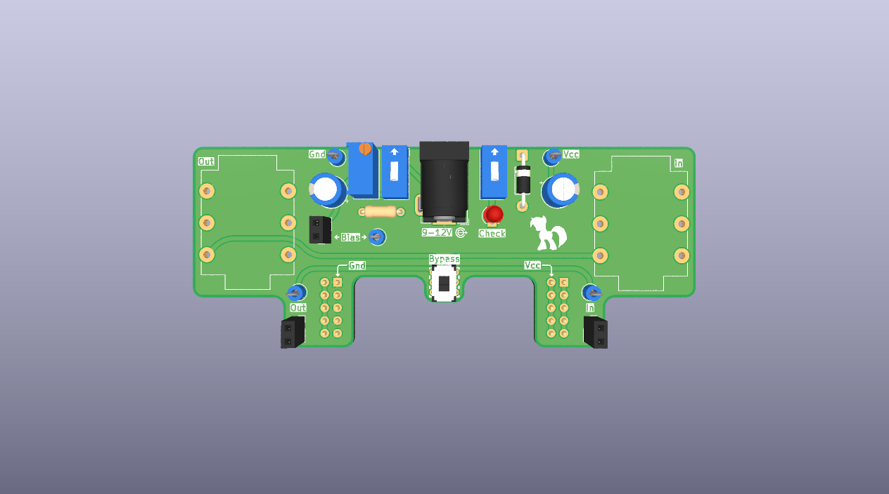
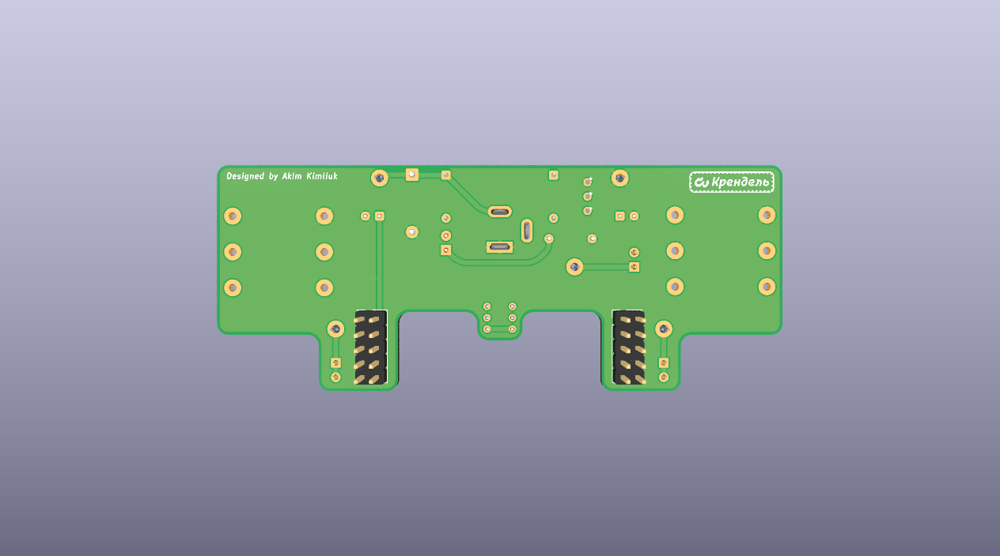

# Twilight Adapter

KiCad project for a 9V-powered audio effects adapter board: input/output audio
jacks, a true-bypass DPDT switch, two DIP switches, a trim potentiometer, an
LED indicator, test points, and header connectors for interfacing with
another board.

## Credit

This design is not mine. It was designed by **Akim Kimliuk** (silkscreened on
the board itself), who gave permission to use it here since he isn't able to
sell it outside his country. All credit for the original design goes to him.

## PCB preview

| Top | Bottom |
|-----|--------|
|  |  |

## Hardware overview

Interactive BOM: [khaosdoctor.github.io/kicad-audio-board-adapter/bom/ibom.html](https://khaosdoctor.github.io/kicad-audio-board-adapter/bom/ibom.html)

| Ref        | Part                  | Function                          |
|------------|-----------------------|------------------------------------|
| J1/J2      | Audio jack (switched) | Input / output                     |
| J5         | Barrel jack + switch  | 9V power input                     |
| SW1        | DPDT switch           | True-bypass footswitch             |
| SW2/SW3    | DIP switch            | Mode/routing selection             |
| RV1        | Trim potentiometer    | Calibration                        |
| D1         | LED                   | Status indicator                   |
| D2         | 1N4001 diode          | Reverse-polarity protection        |
| C1/C2      | 47uF electrolytic     | Power filtering                    |
| R1         | 10k resistor          | Bias/pull                          |
| TP1-TP5    | Test points           | Debug/calibration probing          |
| J3/J4/J8   | 2-pin headers         | Board-to-board connections         |
| J6/J7      | 2x5 headers           | Board-to-board connections         |

The board is a 2-layer PCB designed in KiCad 10.

## Generating manufacturing files with KiBot

This project uses [KiBot](https://github.com/INTI-CMNB/KiBot) to generate
gerbers, drill files, pick & place, BOM, documentation and 3D outputs
straight from the KiCad source files, via `kibot.yaml`.

### Outputs produced

| Group           | Outputs                                                        | Directory              |
|-----------------|------------------------------------------------------------------|-------------------------|
| `fabrication`   | Gerbers, Excellon drill files                                    | `Manufacturing/Gerbers` |
| `assembly`      | Pick & place position file, BOM (CSV)                            | `Manufacturing/Assembly`|
| `documentation` | Schematic PDF, PCB PDF, interactive HTML BOM                      | `Documentation`, `bom`  |
| `3d`            | STEP model, top/bottom 3D renders                                 | `3D`                    |

A zipped bundle of gerbers + drill files ready to send to a fab house is also
produced under `Manufacturing/manufacturing_zip.zip`. A JLCPCB-specific BOM
(`bom_jlcpcb`) filtered to parts with an LCSC part number is available but not
run by default.

### Running locally

Install KiCad (10.x) and KiBot, then from the repository root run:

```bash
pip install kibot
kibot -e Twilight_Adapter.kicad_sch -b Twilight_Adapter.kicad_pcb
```

To generate a single group or output, pass its name as a target, e.g.:

```bash
kibot -e Twilight_Adapter.kicad_sch -b Twilight_Adapter.kicad_pcb fabrication
```

### Running with Docker

No local KiCad/KiBot install is required if you have Docker:

```bash
docker run --rm -v "$(pwd)":/mnt ghcr.io/inti-cmnb/kicad10_auto_full:latest \
  kibot -e Twilight_Adapter.kicad_sch -b Twilight_Adapter.kicad_pcb
```

### Running in CI

The [`kibot.yml`](.github/workflows/kibot.yml) workflow runs KiBot on every
push and pull request and uploads the generated files as a build artifact.
On pushes to `main` it also commits the refreshed `bom/ibom.html`,
`3D/render_top.png` and `3D/render_bottom.png` back to the repo, which is
what keeps the PCB preview and interactive BOM link above up to date.
